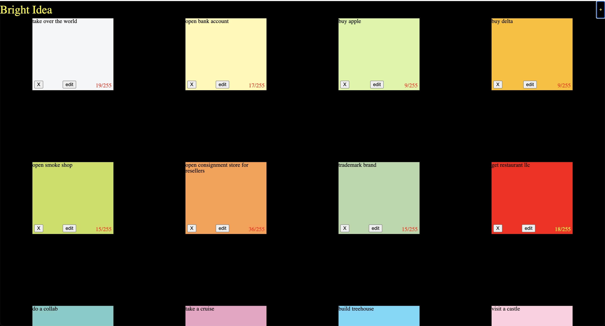

# Bright Idea

is a web application that allows users to create, edit, and delete ideas.
[Original wireframe](https://www.figma.com/file/FdBxVZCUtmtSgWrLRve5ZH/Bright-Idea?type=design&node-id=1%3A2&mode=design&t=MH0AwetpvQRJ1MSq-1)

# Technologies used

- HTML
- CSS
- JavaScript
- PostgreSQL

